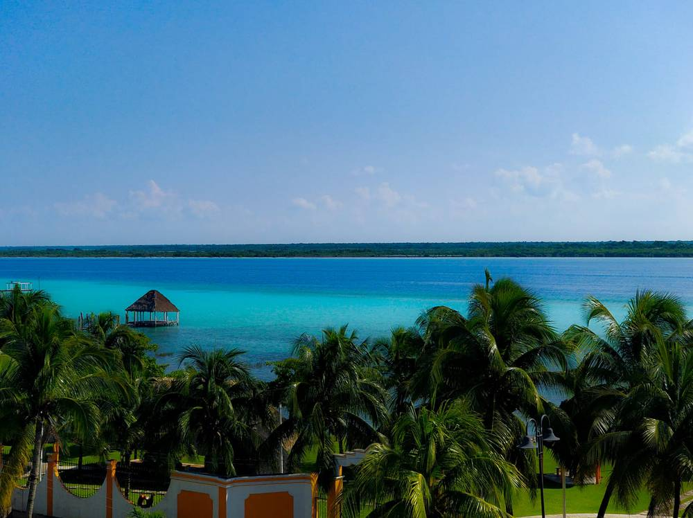
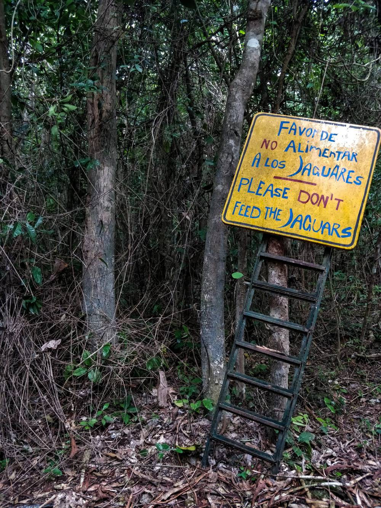
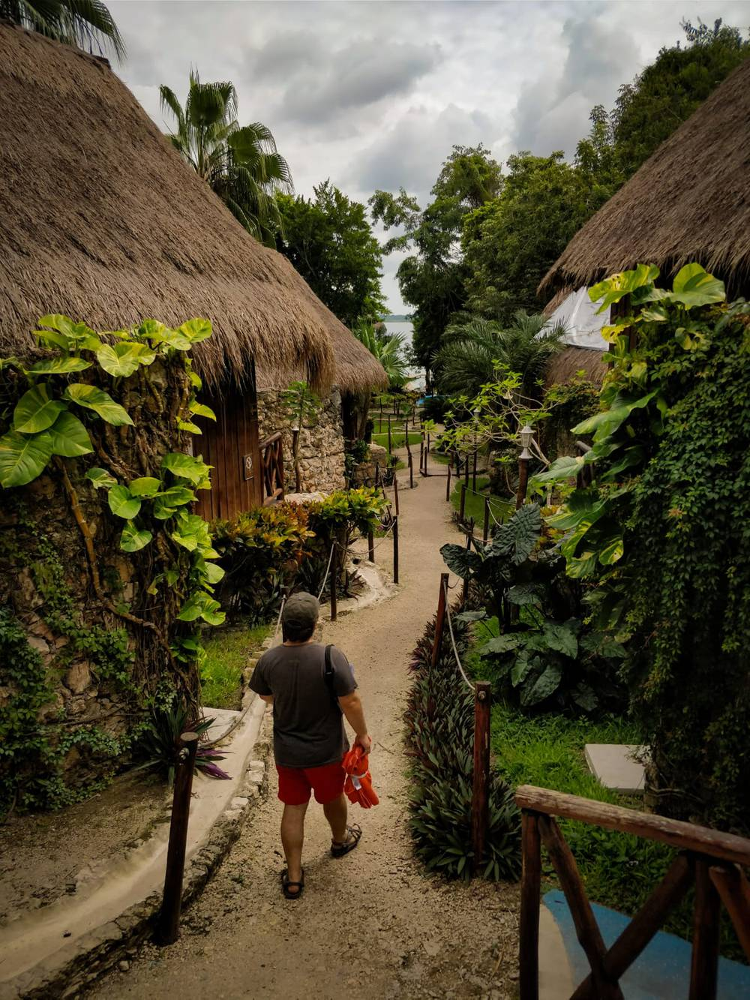
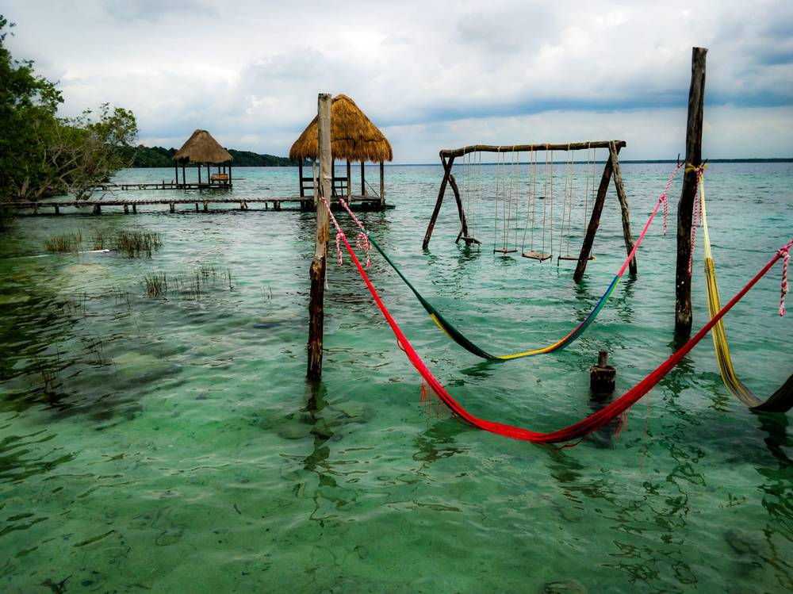
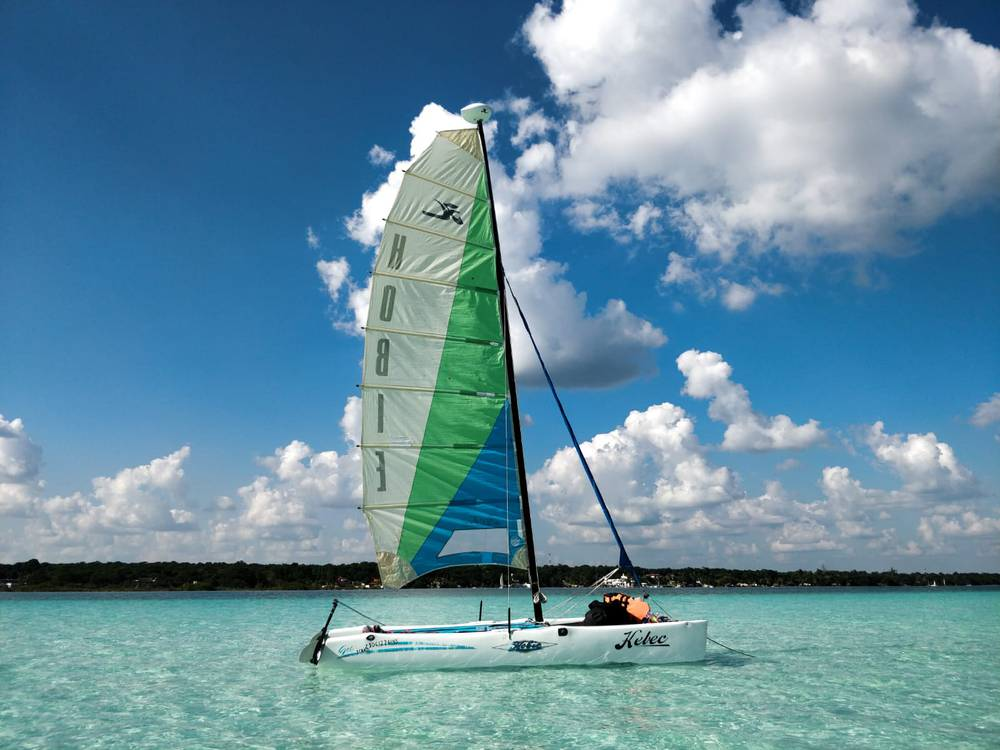
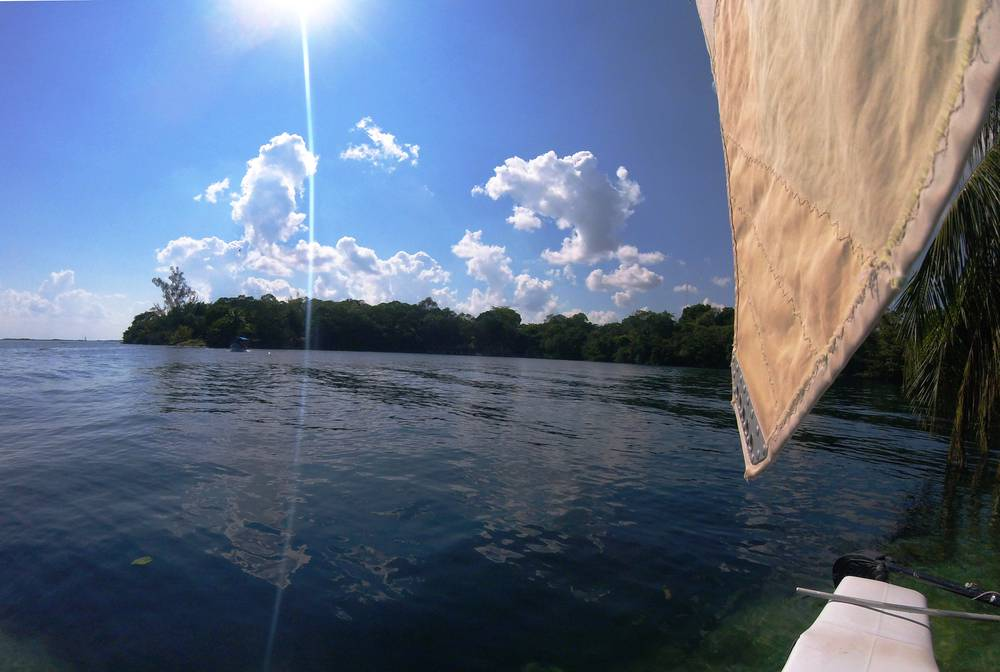
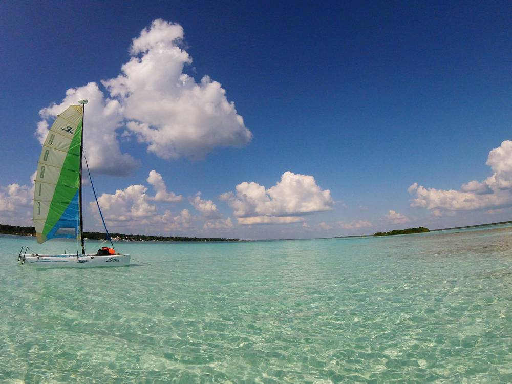
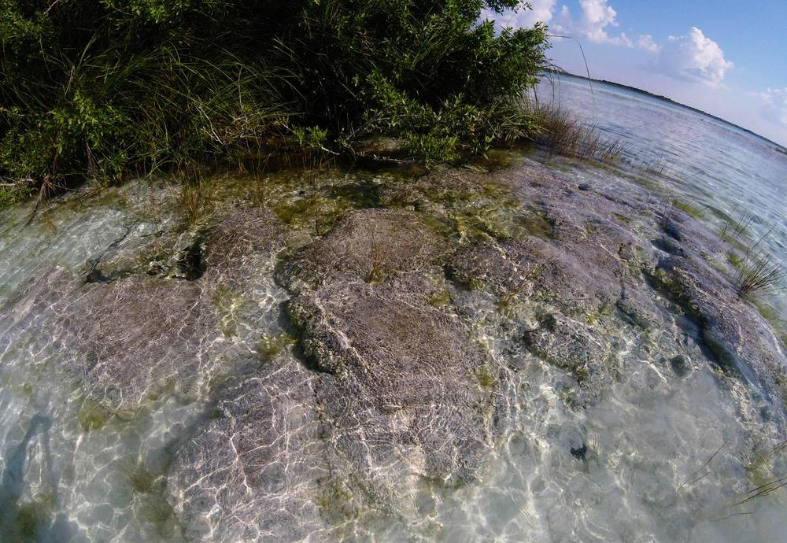
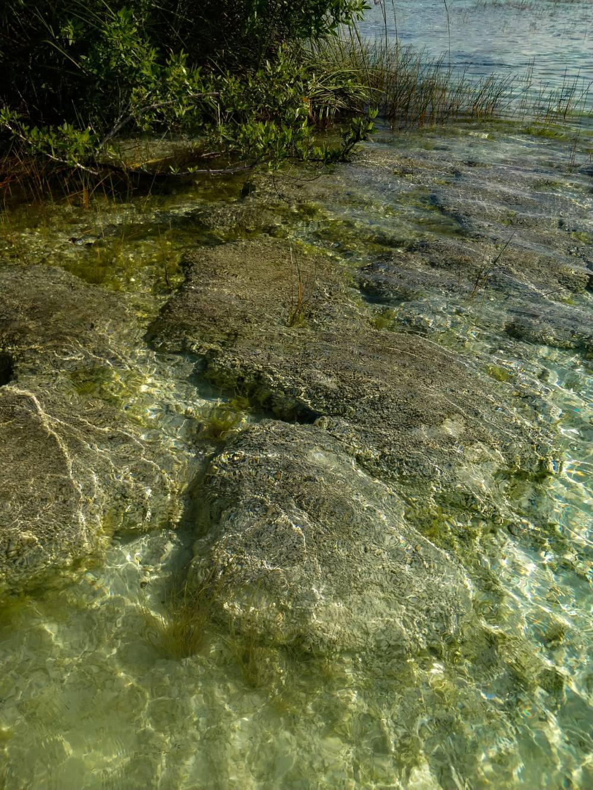
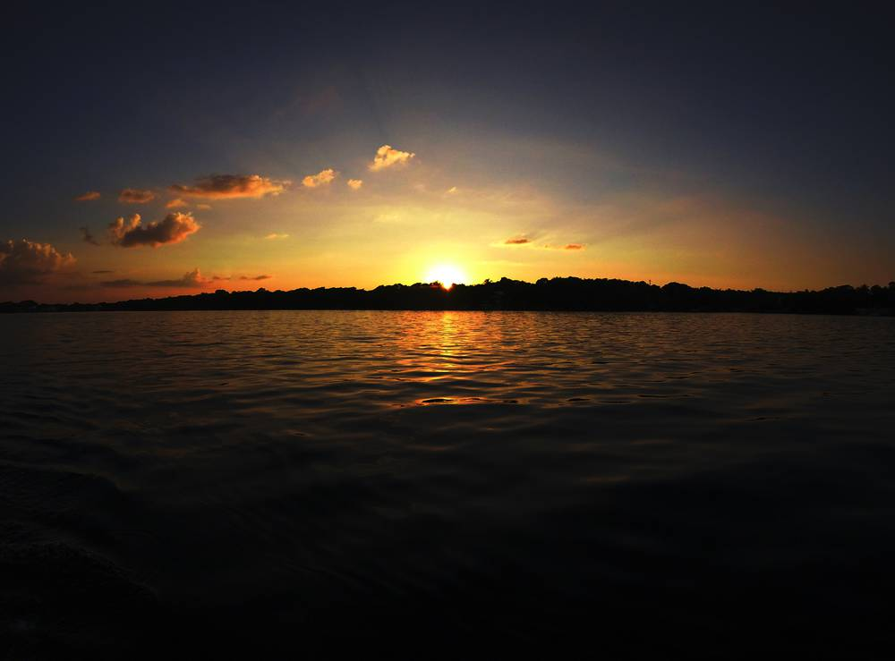

A huge and colorful lagoon is situated at the Mexican state of Quintana Roo near the borders with Belize. Lake Bacalar is known as the **lake of seven colors** due to the multiple hues of the water. The crystalline lake spreads out into the distance almost giving the impression that you are looking out of the Caribbean Sea.  It is about 55 kilometers long, and communicates with the Bay of Chetumal across the Hondo River and the Chaac Estuary.

Quintara Roo, is an extremely popular state of Mexico, that attracts quite a lot of tourists especially to the most known areas like Cancun, Tulum and Playa del Carmen. Bacalar, in contrast, perched on the edge of this amazing lagoon, is a small town largely untouched by the upscale tourism. With more local tourists than foreigners, it is a great place to go in order to combine a few days full of culture and nature.

## A last-minute change at our trip’s itinerary

At the beginning of our trip in Mexico, we didn’t plan to visit Bacalar due to our fulfilled program. However, during our travel and after talking with some locals in the different areas, we decided to modify a bit our itinerary reducing one day from our next destination (which was Tulum) and visit Bacalar. This change had no big effect in our whole trip except of giving us this impressive experience of the lagoon. Probably our best last minute decision we made at a trip! Bacalar is worth it!

This marvelous adventure started from Valladolid, [after exploring the mystery cenotes in Yucatan](/cenotes/). It took us 4 hours to arrive at this pure natural paradise, most of the drive being inside the lush jungle.

<tip title="Making the most of our last minute booking">
Due to limited visiting time and our wish to enjoy as much as we could the lagoon, we decided to book a “cabanas” very close to the lake. Now we can say that this kind of accommodation is not recommended for more than one/two night(s). There are a lot of mosquitos and unless accustomed to it nights tend to be a little bit difficult. If you planned to go there, spend a little bit more time than us to find a room somewhere else with more, but still not expensive, facilities.
However, for one night our choice was not terrible. We managed to sleep enough to be in a good mood for our next day’s adventure!
</tip>

## San Felipe’s fort

Nestling the shores of the lagoon, the Fort of San Felipe offers some of the most spectacular views of the lake. Today it contains a small museum of piracy, including the display of a pirate skeleton that was excavated from the area. In the 17 century pirates where using a natural canal from the ocean to enter the lagoon and get wood for building ships. At the same time they were known to have used that canal to steal from other non wary ships they using the canal to access the ocean from the lagoon. That canal took the name **the route of pirates**. Later in 1725 the fort was built in order to prevent the pirate attacks!

## Sports at lake

Set on the one of the largest freshwater lake in Mexico, it is no surprise that water-sports are popular and abundant here. Gliding across the multi-hued water in a kayak or a paddle board, zipping above it on a Jet Ski, taking out a sailboat or going fishing on this lake, these are some of the adventures the lake can give you.

## Sailing a catamaran at the lagoon

Apart from relaxing sessions, naps in hammocks and lunches in the water, the main activities in Bacalar are in direct relation with the lagoon. We chose to discover the crystal clear waters of the bay with the catamaran tour.

Several hotels and agencies offer some catamaran/sailing tours, but the benefits and services vary a lot. After reviewing the offers and prices, we decided to select a private Catamaran tour for 4 persons, going to it with two Italian friends we met during the first nights in [San cristobal de las casas](/chiapas) and sharing drinks at other common places in our trip.

On board, we could perfectly distinguish all the 7 different colors of the lagoon, it was magnificent! This exotic excursion lasted more than 7 hours, for the pleasure of our eyes. We started sailing in the crystal clear waters of Bacalar and we observed the birds of the bird island.

Then, we went through to discover the 3 underwater cenotes which are in the waters of the lagoon. The water was very dark due to the depth of the cenotes. To observe them more closely, we put on masks and snorkeling equipment and went to discover the seabed of this rare beauty.

Before this experience, we had no clue how sailing worked. Now, and after some other adventures with sailing boats, we got the basic knowledge about it! The primary friend of the earth for the catamaran and generally for the sailing-boats is obviously the wind!

Depending on the direction of the wind, catamaran can go at a faster or slower pace. At our Bacalar’s sailing tour, we were lucky and unlucky at the same time. There were moments that we were going really fast but some others that we were going slowly. It was an educational experience for us, observing the different techniques to use the wind in our advantage.

After an amazing swim in cenotes we headed to the best spot to take a dip in the warm waters of the Bacalar Lagoon. A completely crazy place where suddenly we had our feet at the bottom of the lake and the water was crystal clear! It was really amazing to find ourselves in the middle of this lagoon and hit the bottom.

<photo-composition></photo-composition>

In the Laguna Bacalar, there exist structures similar to coral reefs known as **stromatolites**. These natural unique treasures are composed of rock produced by millions of bacteria which have formed over millions of years. The Laguna’s environment has allowed these life forms to flourish in both number and exceptional size. It is said that they are the biggest stromatolites living in fresh water.
They are considered to be the earliest signs of life discovered on Earth. First time seeing in a lake something like that! It was worth it!

As a bonus, our private sailor took us to coat ourselves with clay enjoying a 100% natural SPA moment.

Our amazing tour ended with an incredible sunset, quietly settled on our catamaran! A stunning view! We would probably miss the sunset if there was more wind to go at a faster pace, but since all of us where quite relaxed with no immediate after plans we enjoyed it thoroughly.

After our sailing trip we headed to Tulum for another 4 nights to conclude our amazing trip!

## A great experience no one should miss

For those of us that have a little more time, or enjoy avoiding the crowds that congregate around the coast, Laguna Bacalar should not be missed!
A natural beauty at its best, Bacalar is a Mexican treasure! We definitely want to go back one day and enjoy once more the peaceful setting and the amazing colors!
