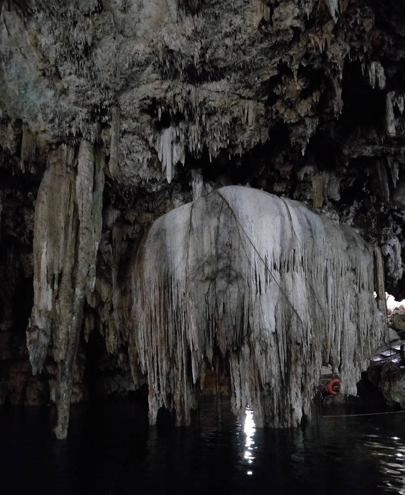
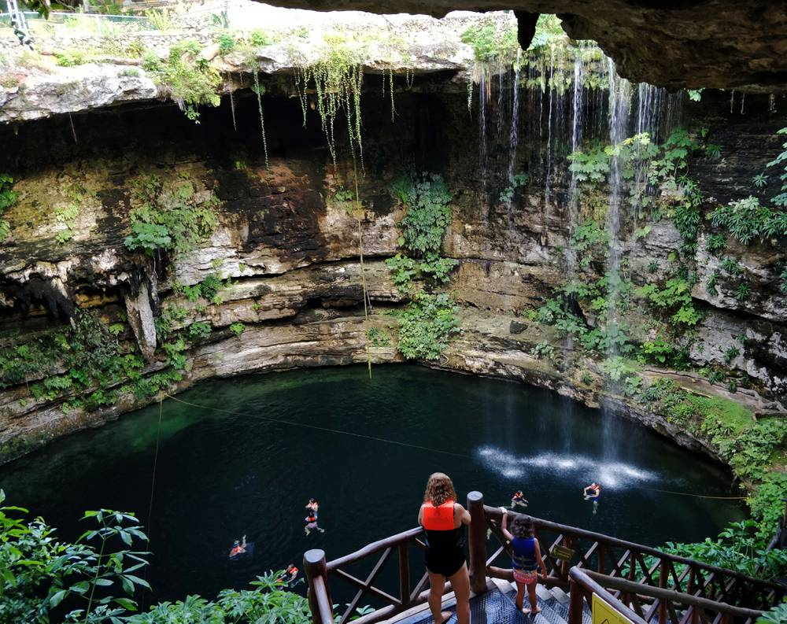
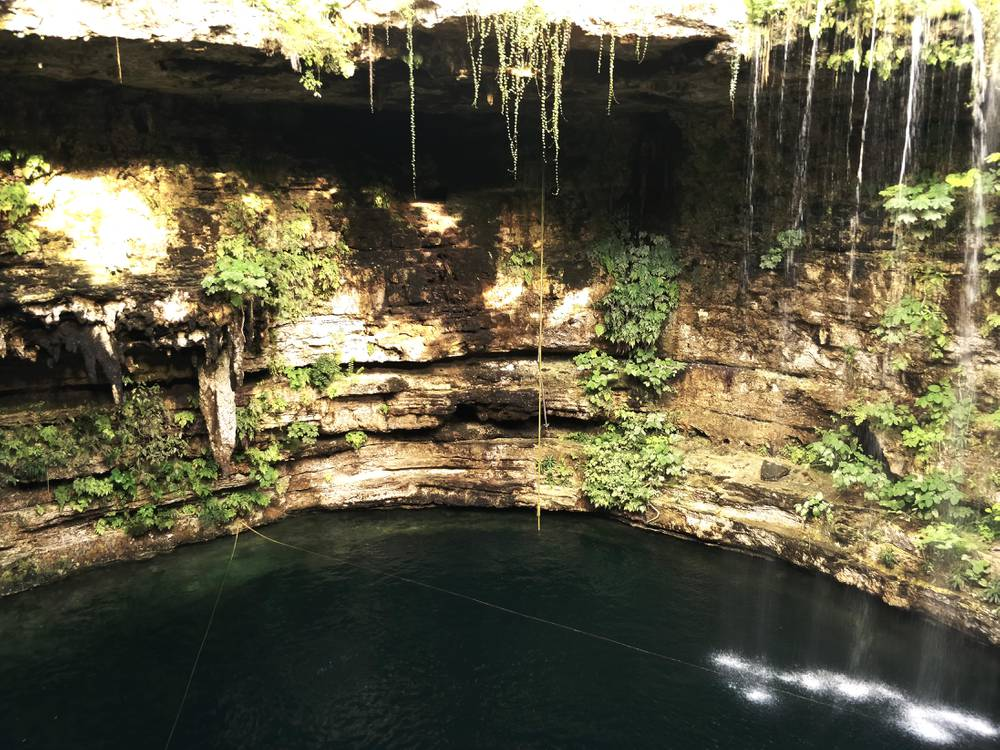
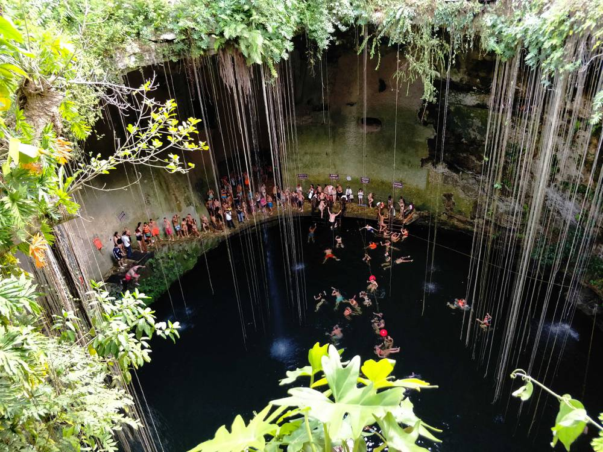
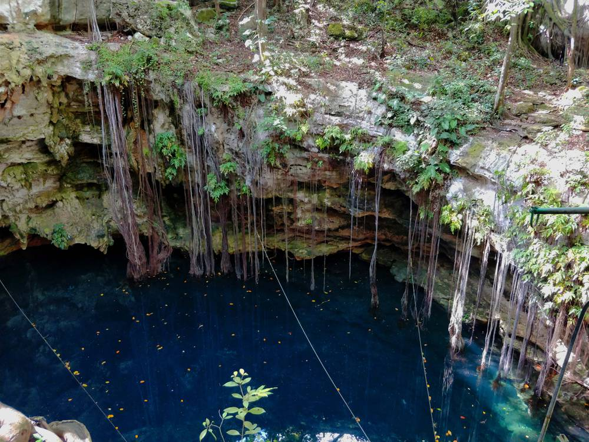
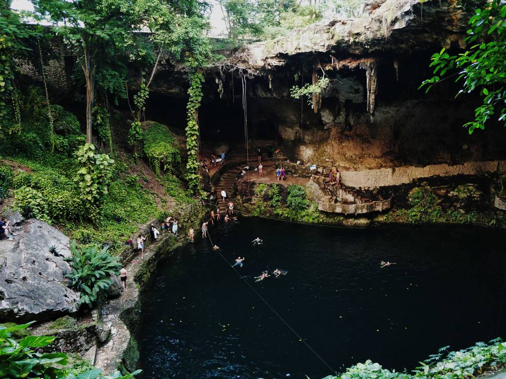

After [Chiapas](/chiapas) and the maya ruins our trip took a completely different note. Cliff jumping and swimming in Cenotes! Our goal was to visit as many as possible! And we managed to cover quite a few of them.

# Cenote

According to Wikipedia, a cenote is a natural pit, or sinkhole, resulting from the collapse of limestone bedrock that exposes groundwater underneath. Cenotes are formed by dissolution of rock and the resulting subsurface void, which may or may not be linked to an active cave system, and the subsequent structural collapse. Rock that falls into the water below is slowly removed by further dissolution, creating space for more collapse blocks.

The Yucatan doesn’t have rivers above ground. So these underground waterways provide all the fresh water for the locals. Almost every Mayan settlement, including the famous Chichen Itza, was built near a cenote.

One might wonder at the end of the day aren't they all the same? And this might be a plausible conclusion, after all they are made of limestone and water! But once we got in a few of them we managed to understand why these places are magical and sacred! The formations are so different, the sun falls different in each of them creating unique colors and the cliffs you can jump from vary a lot! Some of them don't even get to see much of then sun.

# Valladolid

## Accomodation

We chose to stay at the little colonial city called Valladolid being the closest city on the map from all the cenotes we chose to explore. In addition it had a nice square we could spend our nights walking around and it even has a cenote in the city center. What else could we possibly ask for!

## Moving around

We still had our car we rented from Merida and this helped a lot. We were autonomus moving around the cenotes at the pace of our liking and exploring ones not offered by tours.

# San Lorenzo Oxman

Our first exploration started on one of the least known cenotes which is owned by a small family business of a hotel-restaurant. It is a short car ride from the city and it costs a few pesos, much cheaper than the other touristic ones.

<photo-composition></photo-composition>

The whole experience was a blast! You enter the cenote from some stairs leading to the entrance of the cenote. It has ample space for putting your belongings, life vests and a rope for some Tarzan-like fun! We stayed probably a couple or more hours in to swim and jump, jump and jump some more! The water was crystal clear, with lots of fish around. Most of the time we were with maximum another 2 people which made the whole experience even better.

We think this cenote should be the on anyone's list. Much less touristic, without huge crowds and noise and the one we enjoyed the most!

# Dzitnup or Cenote Samula & Cenote Xkeken

Being excited after our morning adventure we continued to some cenotes that are much more known. Next stop Dzitnup cenote which actually involves two separated cenotes. It was quite obvious from the beginning that these two were going to be really different from the first one we visited.

Both get minimal sunlight exposure but what strikes around is the whole commercial business setting. Guides moving around, there is a restaurant, photographers and quite a lot of people as well.

<photo-composition></photo-composition>

Nevertheless it was a pleasant stay here. The uniqueness of the cenotes is well visible. It is pretty dark inside, rendering our task of taking photos more difficult. The water is considerably colder with less life inside.

We also ate at the restaurant around and the food was not exceptional but not bad either. We had our first taste of Cochinita Pibil there and gave us the urge to try more elsewhere!

# Hacienda Restaurante Selva Maya

Another pretty known cenote, situated not very far away from Dzitnup. Another private one with a restaurant and a hotel. This one is pretty organized as well. You are obliged to have a shower and a life vest on when inside the cenote which makes the experience a little cumbersome. There is a spot to cliff jump but it is not that high.

On the other hand the cenote is quite big with a nearly perfect circular cieling and a couple of tiny waterfalls around. We didn't stay there a lot, tending to always avoid the crowds. We didn't try the restaurant having eaten just before but it seemed nice.

# Ik Kil

This cenote is close to Chicen Itza and it is probably the one with the most people around since tour companies provide tours coupling the maya ruin with the cenote.

As soon as we entered the parking space we understood that this one was going to be filled with people. There were a lot of buses around and lots of people visible even at the entrance. This one also had a shower policy but life vest was optional.

The cenote is huge! Like really huge which means a hell of a lot of people inside it! If you are looking for a calm no noise cenote then this is the worst choice. It has a few cliff jumping spots that are high enough for fun and you are left wondering how can people cliff jump from the top on the Red Bull competitions! The ceiling is huge!

# Lol Ha

Another cenote close to Chichen Itza accessible by car on a 30 minutes drive. It is lost in a small village (called Yaxunah) and looks like it is not maintained much. This one is strictly for adventurers, and be prepared to find there the bare minimum, abandonned stairs leading to the cenote!

# Cenote Zaci

We left this one for the end since it was the closest to where we stayed. This one is also one of the cheapest and it has another beautiful setting. The cenote involves nice vegetation around and it looks more like a cave on one side. In our opinion it offered the best spots for cliff jumping. They were heigh enough to give you second thoughts and at the time there were not a lot of people waiting in line to discourage you to go there. We found there only families and locals which probably means something. The water was great!

# Hunting for more

There are a total of 6000 cenotes in the Yucatan peninsula. And we just visited 6 cenotes so we could say in all fairness that've just explored the bare minimum. We would have liked to explore a few more less touristic ones but we couldn't afford to spend more time in the area

After all we were heading to Bacalar, the 7 colors lagoon and then one that has an underwater cenote to explore as well!
