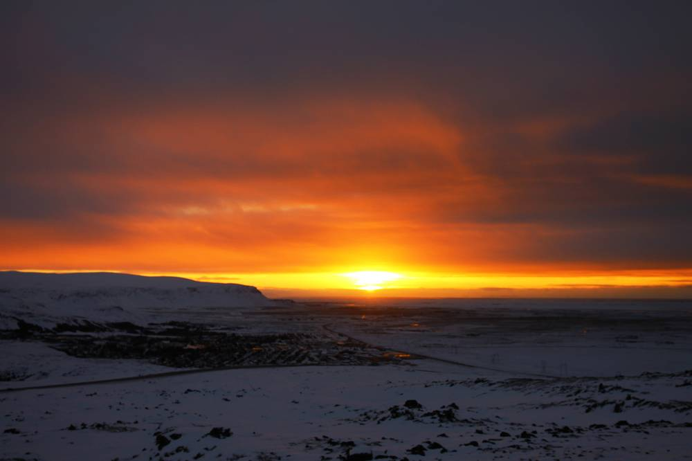
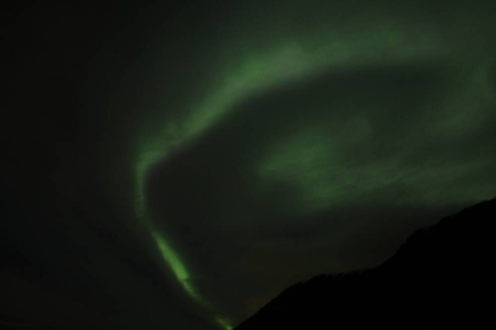
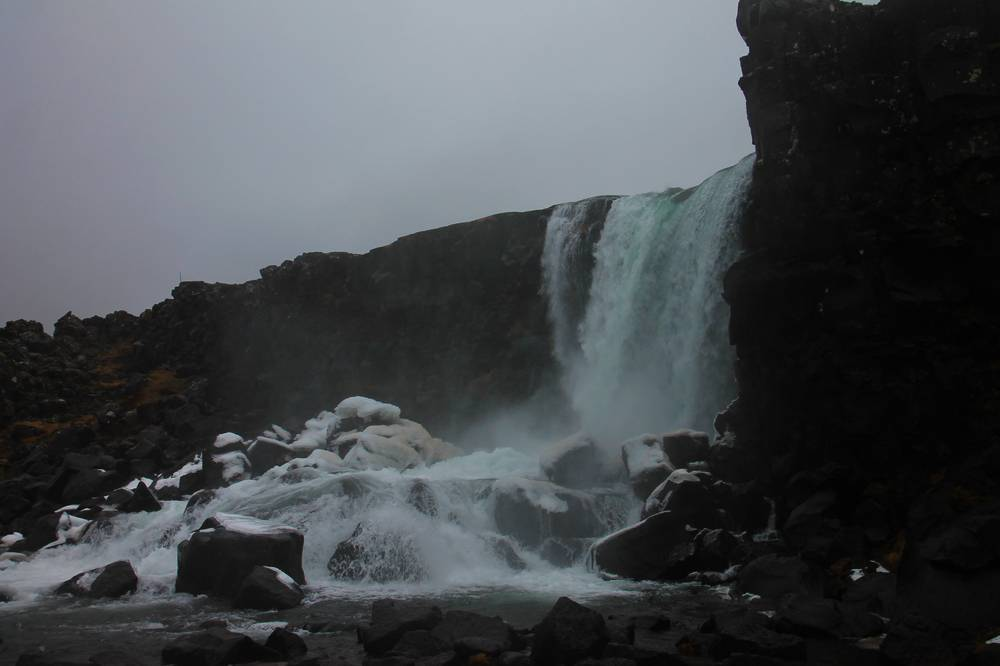
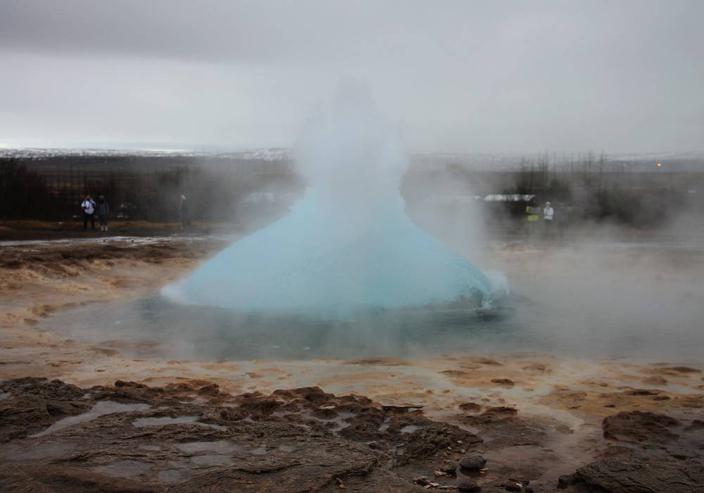
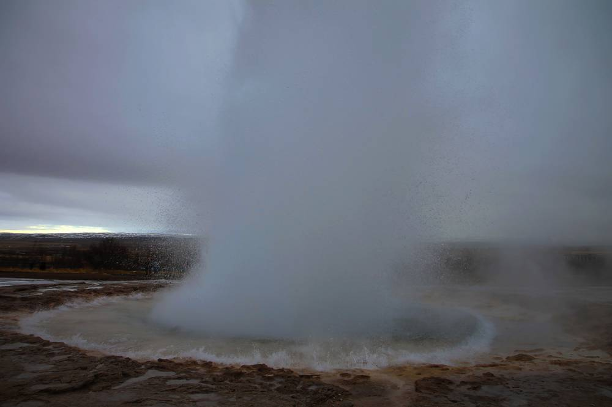
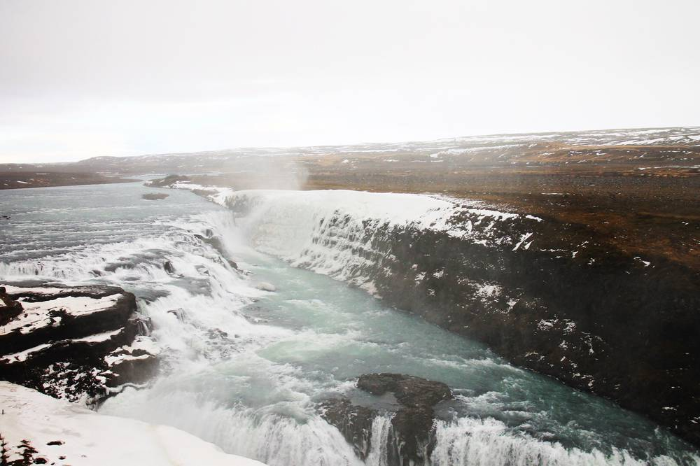
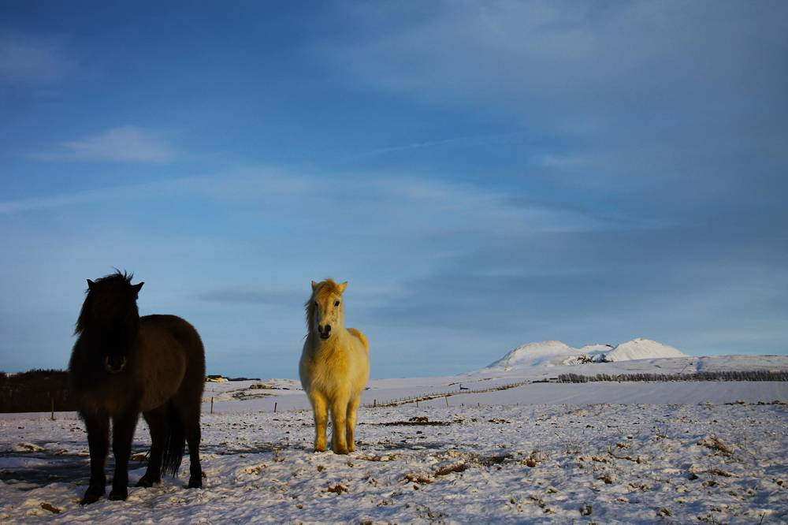
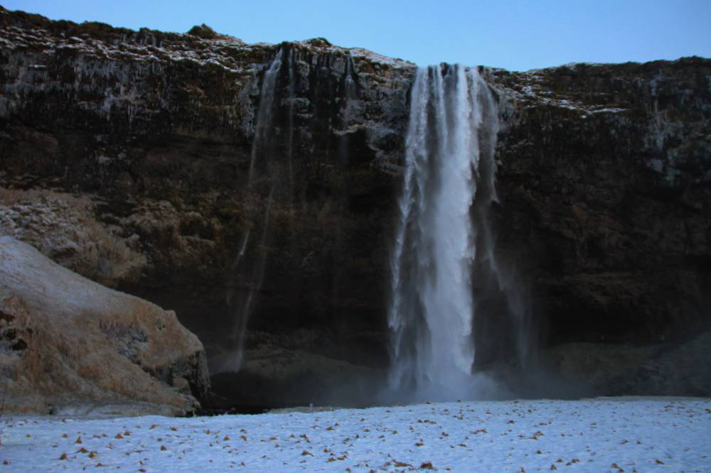
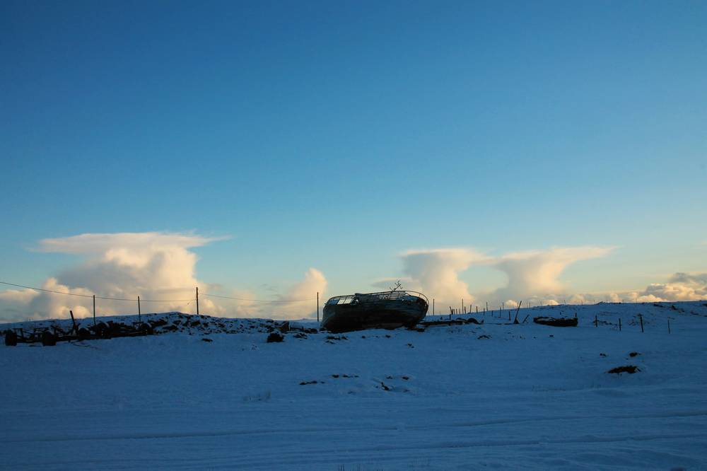

# Preparation

Magical lights, impressive raw landscapes, this short trip to Iceland was a marvelous trip and a true nature experience. We were a group of 8 friends staying at an appartment in the capital and exploring the landscapes by car on 1 day trips during the day and hunting for the northern lights during the night.

We followed all the instructions available online for a winter trip (end of January) at Iceland, meaning being dressed in multiple layers, having snacks in the car etc. We didn't buy any equipment on land since Iceland is quite expensive. We managed to keep the costs relatively low through, having a cheap appartment for many people and cooking on our own.

# Itinerary

Our itinerary was quite simple, during the night we were hunting for the northern lights and during the limited daylight we were exploring the landmark landscapes to get a nice overall feel of the island. We kept one day for visiting the capital and try some whale watching even if we failed at it completely.

<tip title="Creating itineraries">
The available daylight is not lasting a lot. We had to divide our visits into grouped landscapes in order to maximize our potential. With a couple of days more we could have seen much more nature wonders but once again time prevented us!
</tip>

## Northern lights

Our nights were rather simple. The goal was to look at the multiple applications offering predictions on the visibility of the aurora based on different locations, keep a close eye
into the cloud forecast, to avoid low clouds and finally getting lost in remote dark places to avoid light pollution.

Practice makes perfect! After 2-3 days of semi failures, meaning getting to see for a few minutes the lights but not in an enjoyful way due to cars and buses creating light pollution, misinterpreting and underestimating the importance of clouds we managed to get some incredible views. Our semifailures included the road to Thingvellir, since a lot of tour companies use this road and buses are polluting the area, and some remote places around reykjavik that get to have the lighthouse in view hence making the hunt more difficult.

Our best of luck was the day we set out to pass the Hvalfjörður Tunnel, and then follow the road 1 into some dark places. Tour companies are not using this road, probably because the tunnel is rather expensive, which is good for the hunt since there was less and less light pollution. In addition the mountains around hide the reykjavik lights and the area gets to be pretty dark.

<tip title="Shooting photos">
We were quite excited by the opportunity to shoot the northern lights. Once we were on the play though we had to lower our expectations. The freezing cold made us do rather quick moves, and we weren't able to set the focus into an appropriate way to have both a nice view of the lights (infinite focus) but having the mountains or other landscapes around in a non blur way.
</tip>

<tip title="Photos VS reality">
Another set of broken expectations were the intensity of the green color. The images we got to see around the internet are rather false or fake as were our ones. The camera, or at least ours, doesn't seem to be able to identify the correct set of colors hence intensifying them quite a lot. We also did not get to see a lot of deep purple colors with our eyes even though the camera did capture them.
</tip>

## Golden circle

One of our day trips included 3 of the most famous attractions in Iceland. The
Thingvellir National Park, the geysirs and Gullfoss. We couldn't set out early in
the morning since it was quite dark, though we got to arrange our program to arrive when
the lights were out.

First stop was the national park. Quite spectacular views of the tectonic plates getting smashed around. It was a nice first stop with a nice walk around the park, getting to know about the first parliament in Iceland and the geologic specialities in the park.

We then set out to the land of geysirs and were amazed by the spectacular colors and water shots of the Strokkur geysir. While not the one that shoots water at the highest level it is the one that does it every 5-10 minutes. We admired the eruptions quite a lot of times trying also to shoot photos as it is forming up.

There are several other geysirs around although not all of them erupt frequently nor high enough to be impressive. On the other hand some other offer a wide range of vivid colors that are worth visiting.

Finally we headed to Gullfoss just on time for a calm visit before heading back to the city. It didn't strike us for its height but for the force of the waters flowing around as well as the canyon it falls into. We headed out to multiple viewpoints to get a feel of different angles of this  majestic waterfall. And we enjoyed thoroughly. Definetely a must!

## Reykjavik

We did not set any particular goals for our walk around the city. There are definetely some museums around but we were more insterested in getting the feel of the city than being inside walls! Nevertheless we visited the famous cathedral but we quickly got out of the church since as one can imagine it is much more spectacular outside than inside :D

Some places we liked exploring were the area around the city hall, the views of the lighthouse and the streets in the city centre.

This was also the day we booked a whale watching tour that proved to be a total failure for us. We didn't get to see any form of sea life. There is the option of rebooking for free but our days were limited and we probably won't return to Iceland for this tour! A risky business!

## Volcanic sceneries and blue lagoon

Our expectations for volcanoes when we prepared the trip were quite high. We wanted to observe volcanoes from as closely as we could but we weren't interested in the one you could get inside. It was quite expensive and not close enough to our areas of interest.

We chose to drive to Maelifell Volcano since it looked quite accessible and beautiful and then to try and get a look of the famous Eyafjallajökull. On our way we would also have the time to visit another spectacular waterfall, Skogafoss, and the black sand beach.

Unfortunately plans are never perfect and we underestimated the amount of snow available even in late January. Once we were off the main road into a secondary one for the Maelifell volcano we were lucky enough to observe some small waterfalls and some nice animals. But we didn't expect to find huge 4x4 cars coming back full of snow in the wheels from the directions we were heading. They explained us that for our car (normal 4x4) it was practically impossible to reach our desired destination. Too bad we made the wrong choice on this.

So we headed back and onto Skogafoss. The road was this time perfectly fine and the waterfall amazing. We had already forgotten the Maelifell Volcano. After all plans are not written on stone and they are meant to change! However we managed to get a glimpse of the other famous volcano, Eyafjallajökull, even if that happened from the visitor center; meaning quite far away.

Final destination for that day: black sand beach or the Reynisfjara beach. S-P-Ectacular! We were all tired up to that point and not sure if it was worth it. But we were all amazed by its beauty. The color of the sand, the formations of the rocks, the cave next to the beach. Everything forms a magnificent view worth the visit! We could not take any photos though, there was heavy wind at the area, throwing dust everywhere and were afraid not to harm our lense.

Our last volcanic experience was the blue lagoon. We didn't know at the time but the lagoon is not a natural hot spring. The land is natural and the pool is shaped by lava but the water is the result of the geothermal plant that lives nearby. Nevertheless the experience was lovely. We all got a quick shower, stayed a few seconds in the open air to understand how cold it was and we then jumped in the hot pool. An interesting experience we would suggest to anyone.

