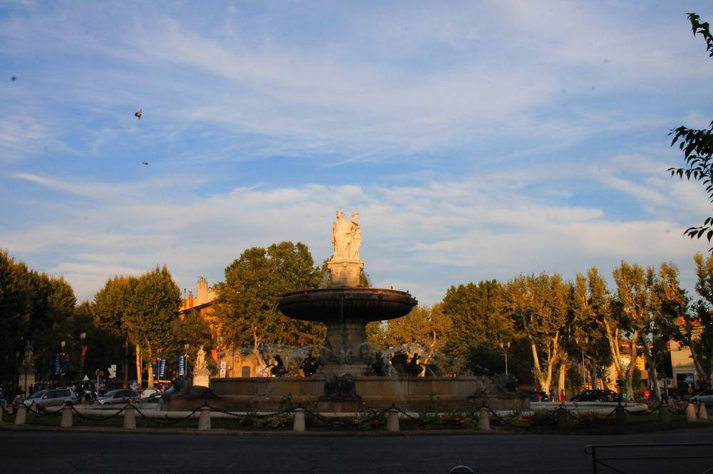
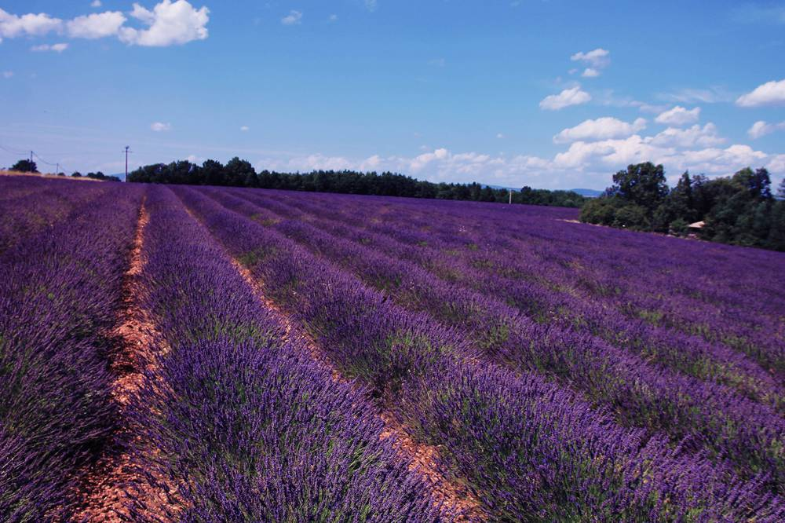
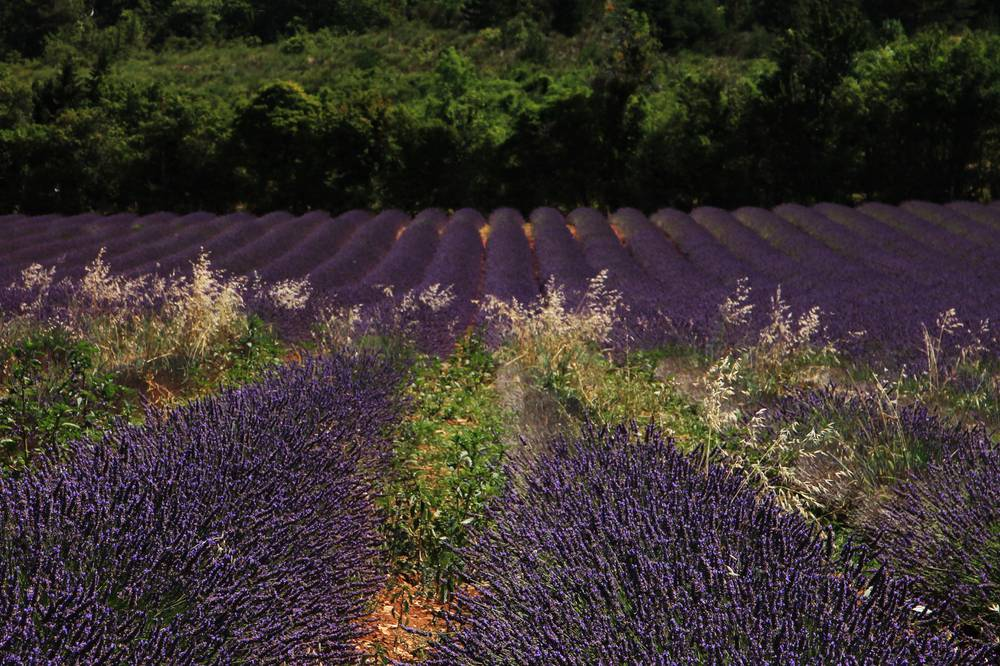
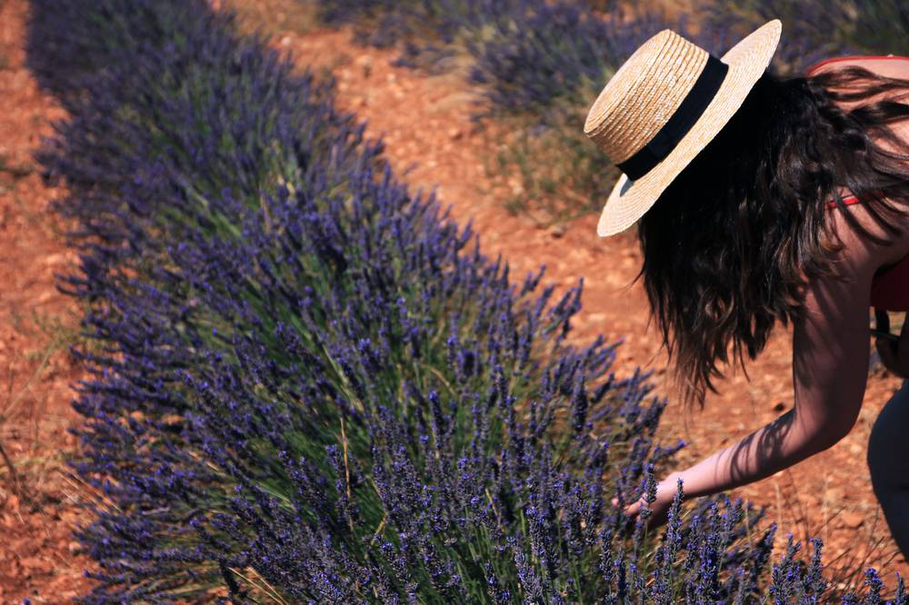

Most of our interests while travelling include nature wonders and culture. In France we try to couple small prolonged weekend with either nature adventures or culture entertainement.

We were always interested in witnessing the lovely purple colors of the lavender fields near Aix en provence as well as exploring the breathtaking views and the vivid blue colors of the Verdon canyon in the same area.

We don't usually plan early in advance our France trips and this was no different. We managed to liberate ourselves, on mid July, for a weekend plus Monday and we chose all of a sudden to wander around the Aix en provence area in search for lavenders and canyon adventures.

In the end our sudden decision to visit that area did not fully pay off. Even if everywhere on the internet people seem to say that lavender has its peak at early July and fields stay colorful till beginning of August, we found out the hard way that due to climate changes they collect lavender quite earlier.
We still managed to observe some nice fields but we were unlucky in the overall experience especially at plateau de Valensole.

<tip title="Planning lavender visits">
If you are planning to do as us then the best solution would be to call the different agriculturers to find out when this year collect will happen. This is what they suggested, calling around May would give you the best information. Latest years the harvest tends to lean more at mid June especially at the Valensole plateau where all the iconic photos are shoot.
</tip>

Our trip was so separated into 3 main sections. First was wandering around Aix en provence, its markets and nice city center, then going by car un our home designed lavender route and finally spending a day at the Gorges du Verdon.

# Aix en provence

The city during the summer days is buzzing with life. Markets are untill late at night and eveything seems quite vibrant and lively. The only downside, the mass of people wandering around the same areas.

We managed to try our fair share of duck recipes since this is the region the are most famous of. And we weren't dissapointed. Intersting flavours, tasty food at a nice setting. We could not ask for more.

# Lavender route

With so many choices around for quaint villages we had to pick a handful of them in a quest to drive around, admire the fields and keep our direction towards the Gorges du Verdon where we would stay the night.

So first stop was the lavender museum at Coustellet. The fields of the museum did not impress us and rightfully so since they are quite small. The history, the available information and the old equipment are what attracted our interest. They also have up to date information about the state of the fields which helped us to better shape up the planning of the day.

<tip title="Lavander vs Lavandin">
You'll also learn the difference of Lavande and Lavandin, which most people ignore. Lavande is the original plant and Lavandin is a natural hybrid that occurs from the mix of two types of Lavande, the "fine" and the "Aspic". Lavandin appears in inferior altitudes than Lavande and in much more quantities. The fields at Valensole are from Lavandin. Other differences include the aroma, their qualities and of course the price!
</tip>

Coming out of the museum with enough information we decided to try the higher altitudes and specifically the Luberon village since Lavandin was for sure already harvested. The road was beautiful and we were buzzing all along with the opportunity to witness the fields. Luckily we didn't have to wait a lot and once we were on higher altitude fields begun to appear.

We got to see some beautifull fields and advance towards Valensole quite happy with our findings and the expectations set. We also got to see some harvest ongoing on a full-bio field. It was quite spectacular.

Unfortunately as we were descending to lower altitude the fields disappeared and we ultimately didn't manage to see any purple fields at Valensole. All of them were harvested and there was only a brown color around. So we headed quite fast to our next destination.

# Verdon

Another hickup of our last minute weekend was that the river going inside the canyon by canoe or paddle was closed. There were indeed some strong winds and it was forbidden by the authorities.

<photo-composition></photo-composition>

The change of plans meant we go to visit the canyon from the different viewpoints around it by car. The views were spectacular and with so many places to stop and admire: the bridge of Lac St. Croix, Pont de l’Artuby, the different viewpoints (belvedere) at Route des Cretes and some of the villages around such as Moustier-Sainte-Marie.

# We will be back

We left full of amazing pictures but with a bitter taste in our mouth. Going there 1 month earlier would have impressed even more. We will probably be back to get the full experience sooner rather than later!
